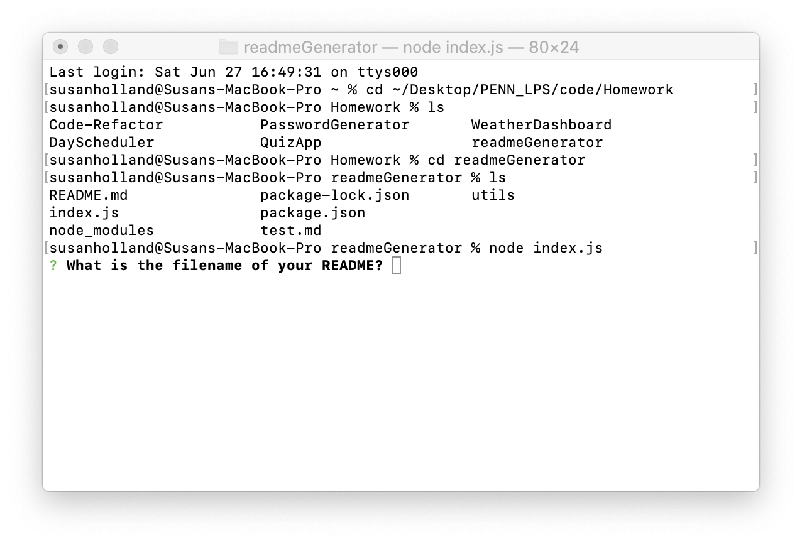
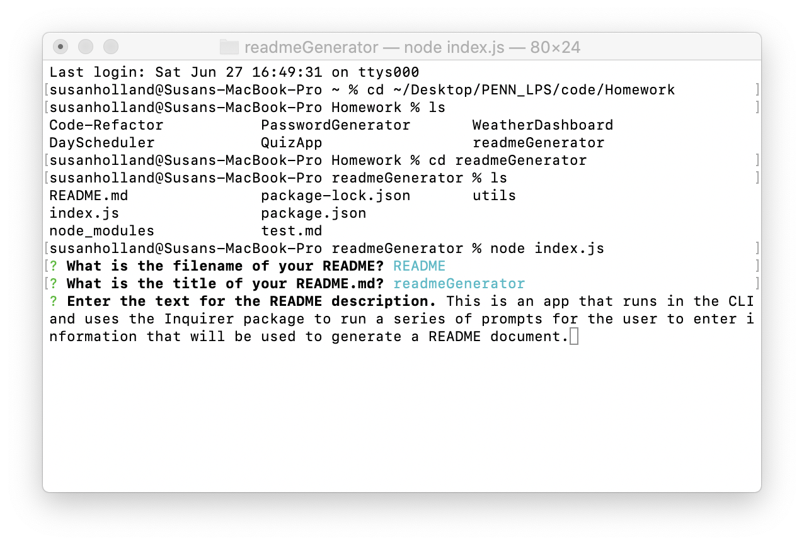
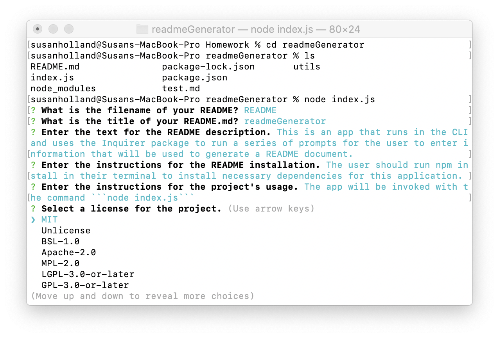
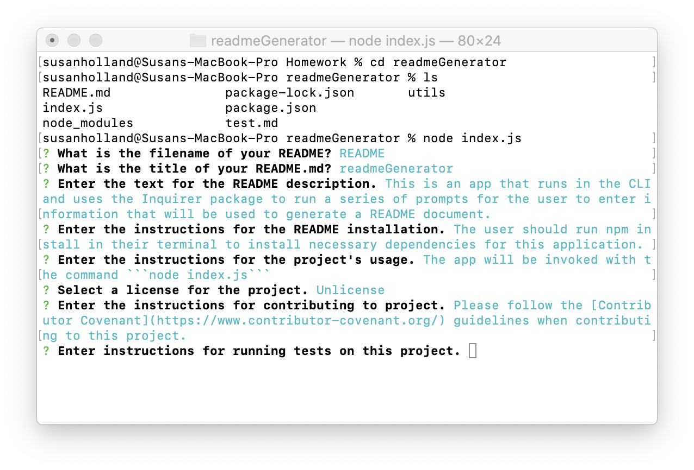
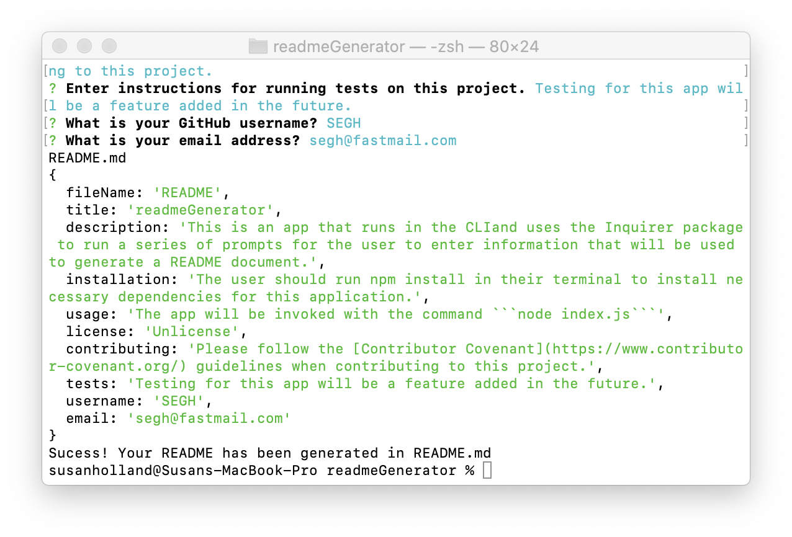
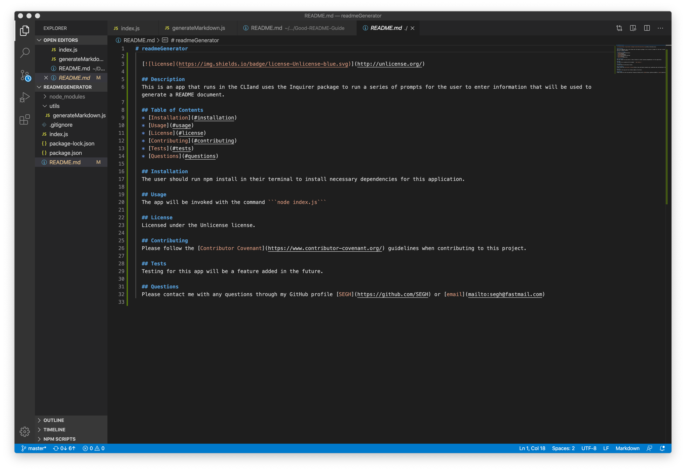
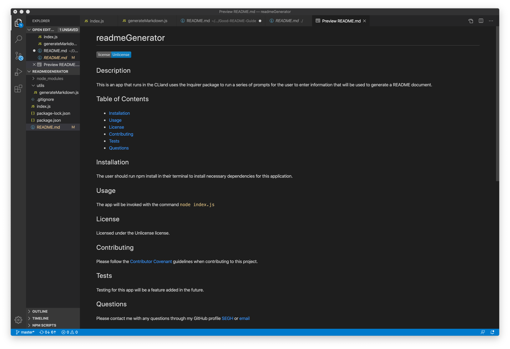

# readmeGenerator

  [](http://unlicense.org/)

  ## Description
  This is an app that runs in the CLI and uses the Inquirer package to run a series of prompts for the user to enter information that will be used to generate a README markdown document. It automatically writes the outline sections Title, Description, Installation, Usage, License, Contributing, Tests, and Questions, as well as a Table of Contents that links to each section. With the user's input, it writes paragraphs under the corresponding outlined sections, displays a clickable badge based on the license the user chose, and provides links to the author's GitHub profile and email in the Questions section.

  ## Table of Contents
  * [Installation](#installation)
  * [Usage](#usage)
  * [License](#license)
  * [Contributing](#contributing)
  * [Tests](#tests)
  * [Questions](#questions)

  ## Installation
  After cloning this repository, the user should run ```npm install``` in their terminal to install necessary dependencies for this application.

  ## Usage
  * The app will be invoked with the command ```node index.js```
  * The user will be prompted to answer a series of questions as seen in these screenshots:

  
  

  * When the user completes the prompts, a success message and the user's inputs are logged to the console

  

  * And a markdown document is generated in the current folder under the filename the user entered.

  

  ## License
  Licensed under the Unlicense license.

  ## Contributing
  Please follow the [Contributor Covenant](https://www.contributor-covenant.org/) guidelines when contributing to this project.

  ## Tests
  Testing for this app will be a feature added in the future.

  ## Questions
  Please contact me with any questions through my GitHub profile [SEGH](https://github.com/SEGH) or [email](mailto:segh@fastmail.com)
